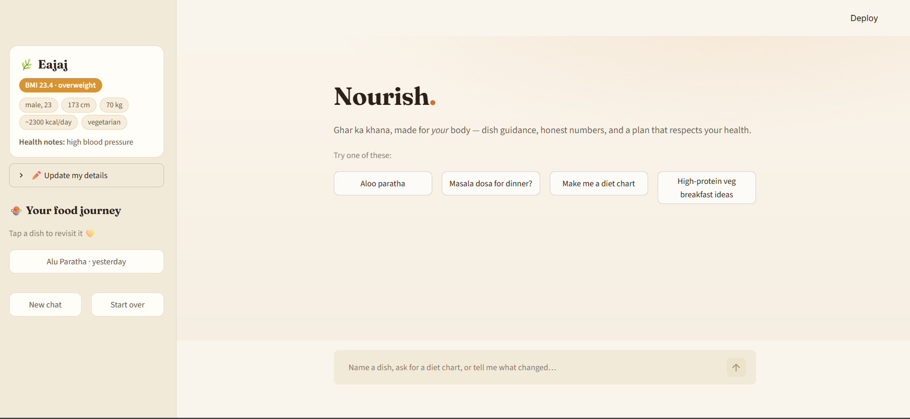

# Nourish


A personal Indian food & nutrition companion. It gets to know you first —
gender, height, weight, health conditions — then answers any Indian-dish
question with how to make it, how much *you* should eat, and honest numbers,
plus a personalised diet chart on demand.



## How it works

```
                        ┌────────────────────────────────────────────┐
        first visit ───▶│ Onboarding (LangGraph human-in-the-loop)   │
                        │ interrupt() per question → profile.db      │
                        └────────────────────────────────────────────┘
                                          │ editable anytime
                                          ▼
 user: "aloo paratha" ──▶ Agent (Groq LLM, LangGraph + SQLite memory)
                              │
                              ├─ 1. vector-less RAG  → recipes.db (1,014 dishes,
                              │       fuzzy name match, exact nutrition)
                              ├─ 2. vector RAG       → Chroma over dish facts,
                              │       curated recipes & the IFCT 2017 PDF
                              ├─ 3. web fallback     → Tavily (auto-chained
                              │       when local matches are weak)
                              ├─ web recipe + story  → trusted-source steps &
                              │       the dish's history ("who created this?")
                              ├─ deterministic engine → exact recipe nutrition,
                              │       healthier swaps (never LLM math)
                              └─ diet chart, profile updates, food journey
```

Every dish answer follows one format: 📜 the dish's story → 🧺 ingredients
with quantities → 👩‍🍳 numbered beginner steps → 🍽️ the right portion for
YOUR profile → 📊 nutrition table (database numbers only) → 💚 personal tips.

Design principle (unchanged from day one): **the deterministic engine and the
databases own every number; the LLM only ever touches language.** And it's
*enforced*, not hoped: a guardrail cross-checks every number in the agent's
answer against the tool outputs it received, and the UI shows a
🛡️ *"n numbers verified against tool data"* badge under each reply.

## Measured retrieval quality

Every level of the RAG cascade is measured against a hand-verified golden
set (`eval/golden_set.yaml`, including known-hard cases so the score stays
honest). Reproduce with `python -m nourish.agent.evaluate`.

| Cascade level | Retriever | Metric | Score |
|---|---|---|---|
| 1 — vector-less RAG | RapidFuzz over recipes.db | hit@1 (24 dish queries) | **92%** |
| 2 — vector RAG | Chroma + MiniLM | hit@4 (10 descriptive queries) | **40%** |
| 3 — web fallback | score-gated Tavily chain | triggered when it should (8 cases) | **88%** |

The level-2 number is a known limitation (MiniLM over table-heavy text) with
a written improvement plan — level 1 answers the common case exactly, and
level 3 catches what both miss.

## Setup

```bash
pip install -r requirements.txt
python -m etl.build_all              # build the SQLite stores (one time)
python -m nourish.agent.build_index  # build the vector index (one time)
```

Put your keys in `.env` (see the placeholders in that file):

```
GROQ_API_KEY=gsk_...       # the agent's brain  (console.groq.com/keys)
TAVILY_API_KEY=tvly-...    # web fallback       (app.tavily.com)
EMBEDDING_API_KEY=hf_...   # optional: HuggingFace Inference API embeddings;
                           # if unset, Chroma downloads a local model instead
```

## Run

```bash
streamlit run app.py          # the chat companion
streamlit run recipe_lab.py   # the original recipe-transformer UI
```

First run asks the onboarding questions in chat (name, gender, age, height,
weight, activity, diet, health conditions — with a follow-up "please
describe" when you mention one). Everything is editable later from the
sidebar or by simply telling the agent ("my weight is 72 now").

## Layout

```
nourish/                deterministic engine (parse → resolve → compute → swap)
nourish/agent/          the conversational layer
  config.py             .env keys
  profile.py            persistent health profile + lenient answer parsers
  vectorless.py         vector-less RAG over the SQLite dish store
  vectorstore.py        Chroma index (dishes + curated recipes + IFCT 2017)
  dietchart.py          grounded one-day plan from profile + real dishes
  agent_history.py      friendly "dishes you asked about" log
  tools.py              11 LangChain tools (DB lookup, hybrid RAG, web recipe
                        + dish-story fetchers, engine, diet chart, profile)
  graph.py              LangGraph: onboarding interrupts + agent ↔ tools loop,
                        SQLite checkpointing (chat survives restarts)
etl/                    build-time: raw data → canonical SQLite stores
app.py                  Streamlit chat UI (.streamlit/config.toml pins the theme)
recipe_lab.py           original transformer UI (still works)
tests/                  96 tests — engine + agent + guardrail (no network)
eval/                   RAG golden set + measured results
PROJECT_GUIDE.md        full technical write-up (stack, architecture, decisions)
INTERVIEW_PREP.md       interview Q&A for presenting this project
```

## Tests

```bash
python -m pytest -q
```
